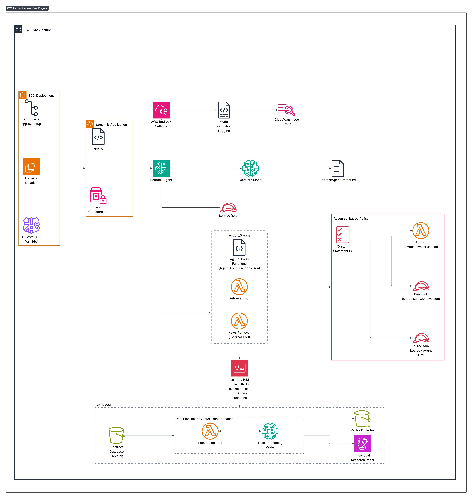

# RAG Agent with AWS Bedrock - Project Documentation

## Overview

This project implements a Retrieval-Augmented Generation (RAG) system using AWS Bedrock Agent, Lambda functions, S3 vector storage, DynamoDB, and a Streamlit frontend. The system retrieves relevant arXiv papers based on user queries and provides intelligent summaries using AI.

## Architecture



## AWS Resources

### Core Components

| Resource Type | Name/ID | Purpose |
|--------------|---------|---------|
| **Bedrock Agent** | `rag-agent` | Orchestrates retrieval and summarization |
| **Lambda Function** | `rag_summarizer-6yz36` | Processes paper retrieval from S3 and DynamoDB |
| **Lambda Function** | `data-ingestion` | Sequential data ingestion pipeline |
| **S3 Vector Bucket** | `kaggle-arxiv-vector-bucket` | Stores vector embeddings of papers |
| **S3 Dataset Bucket** | `kaggle-arxiv-dataset` | Stores raw arXiv paper data (source: `arxiv-metadata-oai-snapshot.json`) |
| **S3 Vector Index** | `arxiv-index` | Vector index for similarity search |
| **DynamoDB Table** | `arxiv_papers` | Metadata storage for papers |
| **EC2 Instance** | `i-007bf5867af749ee3` | Hosts Streamlit application |
| **SSM Parameter** | `/arxiv/ingestion/checkpoint` | Tracks ingestion progress |

### Monitoring

- **Bedrock CloudWatch**: `ragagent > aws/bedrock/modelinvocations`
- **Lambda (RAG) CloudWatch**: `/aws/lambda/rag_summarizer-6yz36`
- **Lambda (Ingestion) CloudWatch**: `/aws/lambda/data-ingestion`

## Setup Instructions for TAs

### Prerequisites

Ensure you have:
- AWS Console access with appropriate permissions
- Access to the EC2 instance via AWS Console

### Step 1: Access the EC2 Instance

1. Navigate to **AWS Console** → **EC2** → **Instances**
2. Locate instance: `i-007bf5867af749ee3`
3. Click **Connect** button
4. Select **EC2 Instance Connect** tab
5. Click **Connect** to open a browser-based terminal

### Step 2: Launch the Streamlit Application

Once connected to the EC2 instance terminal, run:

```bash
streamlit run app.py
```

**Expected Output:**
```
You can now view your Streamlit app in your browser.

Local URL: http://localhost:8501
Network URL: http://172.x.x.x:8501
External URL: http://ec2-xx-xxx-xxx-xxx.compute-1.amazonaws.com:8501
```

### Step 3: Access the Application

1. Copy the **External URL** from the terminal output
2. Open the URL in your web browser
3. The Streamlit interface should load

### Step 4: Test the Application

#### Sample Queries to Try:

1. **Basic Retrieval:**
   ```
   Find papers about transformer architectures
   ```

2. **Specific Topic:**
   ```
   What are the latest developments in large language models?
   ```

3. **Technical Query:**
   ```
   Show me papers on neural network optimization techniques
   ```

4. **Comparative Query:**
   ```
   Compare different attention mechanisms in deep learning
   ```

## System Workflow

### 1. Query Processing
- User submits a query through the Streamlit interface
- Query is sent to the Bedrock Agent

### 2. Retrieval Phase
- Bedrock Agent invokes Lambda function `rag_summarizer-6yz36`
- Lambda function:
  - Searches vector embeddings in `kaggle-arxiv-vector-bucket`
  - Retrieves paper metadata from DynamoDB table `arxiv_papers`
  - Fetches full paper content from `kaggle-arxiv-dataset`

### 3. Enhancement Phase
- External web search tool provides additional context
- Combines retrieval results with current information

### 4. Summarization Phase
- Bedrock Agent uses foundation model to:
  - Synthesize retrieved papers
  - Generate coherent summary
  - Format response for user

### 5. Response Delivery
- Summarized results returned to Streamlit
- Displayed in user-friendly format

## Monitoring and Debugging

### Check Bedrock Agent Logs

1. Navigate to **CloudWatch** → **Log groups**
2. Open: `ragagent > aws/bedrock/modelinvocations`
3. View recent invocations and responses

### Check Lambda Function Logs

1. Navigate to **CloudWatch** → **Log groups**
2. Open: `/aws/lambda/rag_summarizer-6yz36`
3. Review function execution logs, errors, and performance metrics

### Common Issues and Solutions

| Issue | Possible Cause | Solution |
|-------|----------------|----------|
| Streamlit won't start | Port 8501 already in use | Run `pkill streamlit` then retry |
| Connection timeout | Security group misconfigured | Check EC2 security group allows port 8501 |
| No results returned | Lambda timeout | Check Lambda CloudWatch logs for errors |
| Bedrock errors | IAM permissions | Verify Bedrock Agent has access to Lambda and data sources |

## Key Features to Evaluate

### 1. **Vector Search Accuracy**
- Test with domain-specific queries
- Verify relevant papers are retrieved

### 2. **Summarization Quality**
- Check if summaries are coherent and accurate
- Verify key information from papers is preserved

### 3. **Response Time**
- Note the time from query submission to response
- Typical response: 5-15 seconds

### 4. **Web Search Integration**
- Queries about recent topics should include web results
- Check if external information complements paper retrieval

### 5. **Error Handling**
- Try invalid queries
- Verify graceful error messages

## Architecture Highlights

### Why This Design?

1. **S3 Vector Storage**: Efficient similarity search for semantic retrieval
2. **DynamoDB**: Fast metadata lookup with scalable performance
3. **Lambda**: Serverless compute for cost-effective processing
4. **Bedrock Agent**: Orchestrates complex multi-step reasoning
5. **Streamlit on EC2**: Simple, interactive user interface

### Scalability Considerations

- Vector embeddings enable semantic search across large datasets
- DynamoDB auto-scaling for varying workloads
- Lambda concurrent execution for parallel processing
- Bedrock managed infrastructure for AI workloads

## Technical Stack

- **Frontend**: Streamlit (Python)
- **Orchestration**: AWS Bedrock Agent
- **Compute**: AWS Lambda (Python)
- **Vector Storage**: S3 + Vector embeddings
- **Metadata Store**: DynamoDB
- **AI Models**: AWS Bedrock Foundation Models
- **Hosting**: EC2 (Amazon Linux/Ubuntu)
- **Monitoring**: CloudWatch Logs

## Contact & Support

For questions about this implementation, refer to:
- Bedrock Agent documentation: AWS Console → Bedrock → Agents
- Lambda function code: AWS Console → Lambda → `rag_summarizer-6yz36`
- CloudWatch logs for detailed execution traces

---

**Note**: Ensure all AWS resources are in the same region for optimal performance. Default region should be visible in the AWS Console.

## Shutdown Instructions

After evaluation, if needed:
```bash
# Stop Streamlit (Ctrl + C in terminal)
# Or kill the process
pkill streamlit
```

The EC2 instance can remain running or be stopped from the AWS Console.
